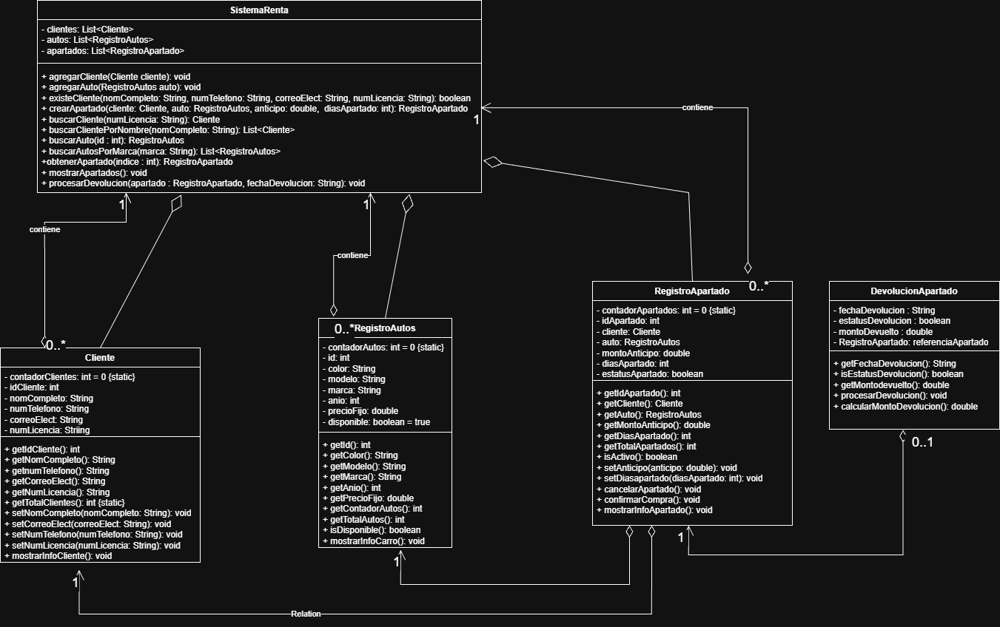

# Sistema de Alquiler de Autos

Aplicación en Java que permite gestionar clientes, autos y apartados dentro de un sistema de renta de vehículos.

## Funcionalidades
- Registro de clientes
- Registro de autos
- Búsqueda de clientes (por nombre o licencia)
- Búsqueda de autos (por ID o marca)
- Creación de apartados
- Procesamiento de devoluciones
- Validación de datos de entrada

## Tecnologías
- Java (JDK 8 o superior)
- Programación Orientada a Objetos (POO)

## Cómo ejecutar
1. Clonar el repositorio:
```bash
git clone https://github.com/KoryFrame/alquiler-autos.git
cd alquiler-autos
```
2. Compilar:
```bash
javac Main.java
```
3. Ejecutar:
```bash
java Main
```
## Estructura
- `Main.java` → Menú principal
- `SistemaRenta.java` → Lógica del sistema
- `Cliente.java` → Modelo de cliente
- `RegistroAutos.java` → Modelo de autos
- `RegistroApartado.java` → Modelo de apartados
- `DevolucionApartado.java` → Gestión de devoluciones
- `Validaciones.java` → Validación de datos

## UML


##  Autor
- KoryFrame
